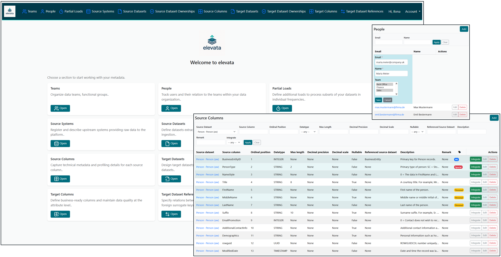

# elevata

<p align="center">
  
</p>

**elevata** is an open-source initiative on a mission to make building modern data platforms radically simpler.  
It is meant to be a **Declarative Data Architecture & Metadata Framework**.  
Automated, governed, and platform-agnostic.

## License & Dependencies

[](LICENSE)
[](https://www.djangoproject.com/)
[](https://htmx.org/)
[](https://getbootstrap.com/)  

---

## 🧭 What is elevata?

**elevata** transforms metadata into architecture.  
It reads source system metadata, derives logical and physical target structures, and enforces consistent, privacy-compliant data models — automatically.

Where most tools stop at SQL generation, elevata goes further:  
it defines **how a modern data architecture should look** — opinionated, governed, and reproducible.  
*In other words: elevata brings structure, governance, and automation to modern data platforms — from metadata to SQL.*

<p align="center">
  
</p>

---

## 💡 Philosophy & Design Principles

elevata is not a query builder — it is a **data architecture engine**.  
Its purpose is to take what is usually scattered across SQL scripts, YAML files, and undocumented conventions — and make it **explicit, governed, and automatable**.

| Principle | Description |
|------------|--------------|
| 🧭 **Opinionated by design** | elevata enforces clear best practices for how data platforms are structured — from `raw` to `serving`. It removes ambiguity, so every dataset has a defined place and purpose. |
| 🧠 **Metadata drives everything** | All logic lives in the metadata — datasets, keys, lineage, governance. This makes data architectures reproducible, transparent, and explainable. |
| 🧩 **Convention over configuration** | Instead of infinite options, elevata provides intelligent defaults. Teams can override them — but only when they truly need to. |
| 🔐 **Privacy by architecture** | Surrogate keys are generated through deterministic, pepper-based hashing. No lookups, no stored secrets, full DSGVO compliance. |
| 🧮 **Declarative, not imperative** | The user declares *what* should exist, not *how* to code it. elevata generates the optimal technical representation. |
| 🌍 **Tool independence** | External engines (like dbt) can consume elevata’s metadata, but elevata does not depend on them. It stands on its own — portable, transparent, future-proof. |

> **In short:**  
> elevata does for data architecture what version control did for code —  
> it makes structure explicit, reproducible, and collaborative.

---

## 🚀 Key Capabilities

- Automated generation of target datasets and columns  
  from imported metadata, including PK propagation and surrogate key creation  
- Deterministic, lookup-free surrogate keys (SHA-256 + runtime-loaded pepper)  
- Full lineage model for datasets, columns, and relationships  
- Multi-source unification via shared `target_short_name`  
- Integrated governance (sensitivity, ownership, access intent)  
- Optional SQL rendering layer (dbt-compatible, but not dependent)  
- Complete metadata persistence via Django ORM  

---

## 🧩 Architectural Layers

elevata defines and enforces a clean five-layer target architecture:

| Layer | Purpose |
|--------|----------|
| **raw** | Original landing of data, 1:1 from source (audit & compliance) |
| **stage** | Early technical normalization (flattening, type harmonization) |
| **rawcore** | Technically harmonized core (surrogate keys, dedup, historization) |
| **bizcore** | Business logic and truth layer — KPI-ready, regulated |
| **serving** | Consumption layer for analytics, dashboards, and ML models |

Each layer is represented as a `TargetSchema` with defined defaults for  
materialization, historization, and governance.

---

## 🧮 Example: Deterministic Surrogate Key Generation  
*Surrogate keys in elevata are not random — they are deterministic, governed, and fully reproducible across systems.*
```
MANDT~100|KUNNR~4711|null_replaced
↓ (runtime pepper)
SHA-256 = sap_customer_key
```

- Unique and stable across systems  
- No lookup required for FK propagation  
- Fully DSGVO-compliant (hashed with runtime pepper)

---

## 🧭 Roadmap

### Milestone 0.3.x — Metadata Model Freeze & Automated Target Modeling
- New `TargetSchema` model (raw → serving)  
- Automatic `TargetDataset` / `TargetColumn` generation  
- Surrogate key hashing with runtime-loaded pepper  
- Deterministic FK mapping via key-component relationships  
- Extended metadata profiling and sensitivity classification  
- Logical Plan for platform-independent SQL generation  

### Planned Mid-term
- SQL rendering / execution layer (Snowflake, BigQuery, Databricks, Fabric)  
- Multi-source unification (sap1/sap2 → sap)  
- Environment-aware metadata validation  
- Lineage visualization and impact analysis  

### Planned Long-term
- Declarative deployment to physical schemas  
- Governance-driven access control  
- REST / GraphQL API for metadata access  
- Extended platform support  

---

## ⚙️ Quickstart
Get elevata running locally

### ⚙️ Environment:

Install
- Python 3.11+ (currently tested on 3.11)
- Git

Copy file .env.example in root folder and name it **.env**. This is the place where your environment variables are stored.

```bash
# 1. clone the repo
git clone https://github.com/elevata-labs/elevata.git
cd elevata

# 2. create & activate a virtual environment
py -3.11 -m venv .venv
.venv\Scripts\activate # or source .venv/bin/activate on Linux

# 3. install dependencies
python -m pip install --upgrade pip 
pip install -r requirements/base.txt
```

### 🛢️ Metadata Database:

#### Step 1: Choose your database management system
**Option A**: SQLite (default database):
nothing to prepare. Continue with **Step 2**

#### Option B: PostgreSQL: 
For using this option, first update your .env file by DB_ENGINE=postgres.  
Then install postgres extras: 
```bash
pip install -r requirements/postgres.txt
```

**Postgres Alternative 1**: You can run postgres (17) locally with docker:
```bash
docker compose -f core/postgres/docker-compose.yml up -d db
```
**Postgres Alternative 2**: Use your **own** PostgreSQL (no Docker):  
If you already have a PostgreSQL server (managed or self-hosted), configure elevata to use it:
Configure connection via discrete DB_* variables in your .env file.  
Ensure role & database exist (if you need to create them):

```bash
create role elevata login password 'elevata';
create database elevata owner elevata;
```

#### Step 2: Setup database

```bash
# 1. set up database and create an admin user
cd core
python manage.py migrate
python manage.py createsuperuser

# 2. run development server
python manage.py runserver
```
Then open http://localhost:8000 in your browser and log in with your newly created superuser account.

---

## 🔐 Secure Metadata Connectivity (since v0.2.0)

Starting with **elevata 0.2.0**, metadata for source systems can be imported directly from relational databases 
via **SQLAlchemy** – fully parameterized through a unified connection profile.

This makes it possible to automatically read table and column structures for any defined `SourceDataset`  
and populate the `SourceColumn` model, including datatype mapping and primary-key detection.

### How it works

- elevata connects to your defined **SourceSystems** using credentials managed via a **profile configuration file**.
- The default profile file is: **elevata/config/elevata_profiles.yaml**
- Connection and security details (passwords, connection strings, Key Vault references)  
are resolved dynamically through your local `.env` file or optionally through Azure Key Vault.

The logic follows a strict **Single Point of Truth** principle:
- Metadata is always read from the configured source system itself.
- Environment-specific secrets are stored outside the database.
- Profiles are shared across environments — only the `.env` (or Key Vault) differs.

### Supported Sources

For detailed database support and ready-to-copy SQLAlchemy URI examples,
see **[docs/source_backends.md](docs/source_backends.md)**.

*Note:* Some platforms can be selected and documented in elevata,
but are not yet supported for automated metadata import. The UI will
show a clear hint in those cases.

---

### ⚙️ Configuration Overview

| File | Purpose |
|------|----------|
| **.env** | Holds environment-specific variables like DB credentials or Azure Key Vault settings. |
| **config/elevata_profiles.yaml** | Central definition of connection profiles and secret templates. |
| **/etc/elevata/** *(optional)* | System-wide defaults for production or containerized deployments. |

Example `.env` entries see template file **elevata/.env.example**  
Example `elevata_profiles` entries see template file **elevata/config/elevata_profiles.example.yaml**

---

## Disclaimer

This project is an independent open-source initiative.  
- It is not a consulting service.  
- It is not a customer project.  
- It is not in competition with any company.  

The purpose of elevata is to contribute to the community by providing a metadata-driven framework for building data platforms.  
The project is published under the AGPL v3 license and open for use by any organization.

---

## 🧾 License & Notices

© 2025 Ilona Tag — All rights reserved.  
**elevata™** is an open-source software project for data & analytics innovation.  
The name *elevata* is currently under trademark registration with the German Patent and Trade Mark Office (DPMA).  
Other product names, logos, and brands mentioned here are property of their respective owners.

Released under the **GNU Affero General Public License v3 (AGPL-3.0)**.  
See [`LICENSE`](LICENSE) for terms and [`NOTICE.md`](NOTICE.md) for third-party license information.