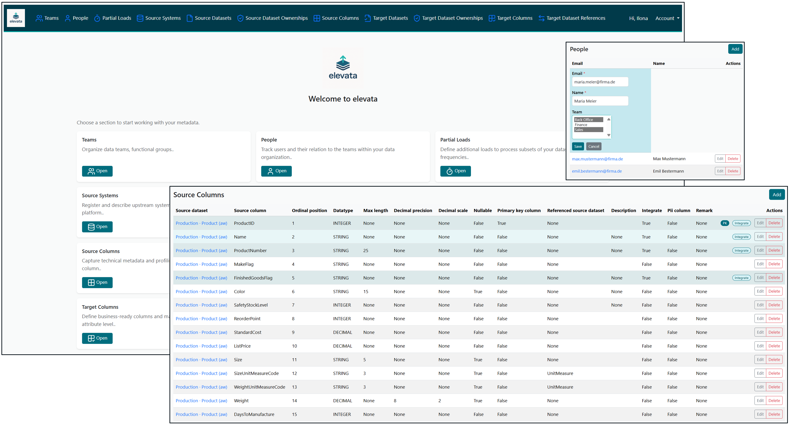

# elevata – Metadata-driven Data Platform Framework

<p align="center">
  
</p>

**elevata** is an open-source initiative on a mission to make building modern data platforms radically simpler.  
Metadata-driven. Best practices included. Easy to use.

## License & Dependencies

[](LICENSE)
[](https://www.djangoproject.com/)
[](https://htmx.org/)
[](https://getbootstrap.com/)
<!-- Planned for v0.2.0:
[](https://docs.getdbt.com/docs/core/connect-data-platform/duckdb)
-->

---

## What is elevata?

elevata is a framework for metadata-driven data platform development.  
The goal is to let teams design and operate data platforms with minimal effort – powered by:  

- **Metadata Management** - lightweight UI built with Django, SQLite and HTMX - bridging business metadata and data engineering
- **Ingestion** – simplified, parameter-driven data loading  
- **Transformation** – built on dbt, with metadata at the core  
- **Orchestration support** – helper files for integration with common orchestrators,  
  fully **lineage-driven from source to target**

It’s still early days – but the direction is clear:  
**metadata in → best practices out.**

---

## 🎬 Quick Glance



---

## ✨ What’s inside elevata today

**elevata** already brings together the essentials for a modern, metadata-driven data platform —  
all in one lightweight, open-source framework:

- 🧩 **Metadata Management Made Simple**  
  Manage your platform structures through a clean, responsive web interface.  
  Inline edits, audit tracking, and user management built right in.

- ⚙️ **Flexible Database Backend**  
  Start instantly with SQLite — or go production-ready with PostgreSQL, via Docker or your own instance.

- 💡 **Built for Builders**  
  Clean Django + HTMX foundation, easy setup, and extensible architecture for future modules like ingestion and dbt-based transformations.

- 🔒 **Secure by Default**  
  Authentication, CSRF protection, and consistent form handling are already integrated.

- 🌍 **Open, Transparent, and Evolving**  
  100 % open source under the **AGPL-v3** — growing step by step towards a full metadata-driven platform.

---

## 🚀 Quickstart

Get elevata running locally

### ⚙️ Environment:

Install
- Python 3.11+ (currently tested on 3.11)
- Git

Copy file .env.example in root folder and name it **.env**. This is the place where your environment variables are stored.

```bash
# 1. clone the repo
git clone https://github.com/elevata-labs/elevata.git
cd elevata

# 2. create & activate a virtual environment
py -3.11 -m venv .venv
.venv\Scripts\activate # or source .venv/bin/activate on Linux

# 3. install dependencies
python -m pip install --upgrade pip 
pip install -r requirements/base.txt
```

### 🛢️ Metadata Database:

#### Step 1: Choose your database management system
**Option A**: SQLite (default database):
nothing to prepare. Continue with **Step 2**

#### Option B: PostgreSQL: 
For using this option, first update your .env file by DB_ENGINE=postgres.  
Then install postgres extras: 
```bash
pip install -r requirements/postgres.txt
```

**Postgres Alternative 1**: You can run postgres (17) locally with docker:
```bash
docker compose -f core/postgres/docker-compose.yml up -d db
```
**Postgres Alternative 2**: Use your **own** PostgreSQL (no Docker):  
If you already have a PostgreSQL server (managed or self-hosted), configure elevata to use it:
Configure connection via discrete DB_* variables in your .env file.  
Ensure role & database exist (if you need to create them):

```bash
create role elevata login password 'elevata';
create database elevata owner elevata;
```

#### Step 2: Setup database

```bash
# 1. set up database and create an admin user
cd core
python manage.py migrate
python manage.py createsuperuser

# 2. run development server
python manage.py runserver
```
Then open http://localhost:8000 in your browser and log in with your newly created superuser account.

### ✍️ Notes
For production, set ALLOWED_HOSTS in .env (comma-separated), eg.:  
ALLOWED_HOSTS=localhost,127.0.0.1,example.com

### 🛠️ Troubleshooting

- `psycopg.errors.InvalidCatalogName: database "elevata" does not exist`
  - Create DB first (`create database elevata owner elevata;`) or pick the right name.

- Upgrading Postgres major version (e.g., 16 → 17) with Docker:
  - Either reset the data volume (`docker compose down -v; docker compose up -d db`), **or**
  - Dump/restore: `pg_dumpall` on old → start new → `psql < backup.sql`.

---

## Backend Support

elevata is designed to support multiple backends for flexible data platform development.  

First will be supported:
- ✅ DuckDB

Planned:
- 🔜 Microsoft Fabric
- 🔜 Snowflake
- 🔜 BigQuery
- 🔜 Databricks
- 🔜 SQL Server

Each backend has its own prerequisites.  
See [docs/backends.md](docs/backends.md) for details.

---

## Disclaimer

This project is an independent open-source initiative.  
- It is not a consulting service.  
- It is not a customer project.  
- It is not in competition with any company.  

The purpose of elevata is to contribute to the community by providing a metadata-driven framework for building data platforms.  
The project is published under the AGPL v3 license and open for use by any organization.

---

## Trademark Notice

© 2025 Ilona Tag.  
elevata™ is an open-source software project for data and analytics innovation.  
The name *elevata* is a pending trademark registration at the German Patent and Trade Mark Office (DPMA).  
Other product names, logos, and brands mentioned here are property of their respective owners.  
The software is released under the MIT License.